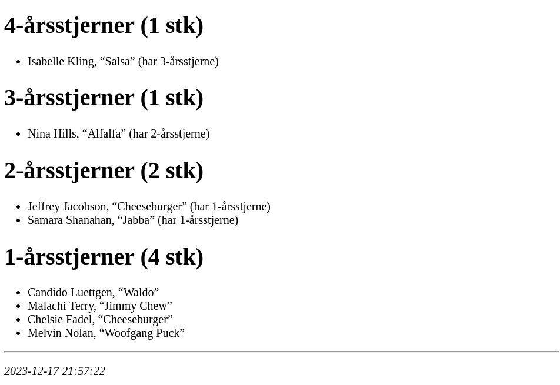

# Lav liste over hvem der skal have nye årsstjerner

> [!CAUTION]
> Work in progress.

Et CLI-tool der kan trække en liste over hvem der skal have nye
årsstjerner.

For at komme på listen skal man:

- Være aktivt medlem
- Ikke være leder
- Have været medlem i mindst 1 år og højest 10 år (svarende til de
  årstejner der kan uddeles)

Længden af medlemsskab beregnes ud fra de medlemsskaber (aktive og
tidligere) der er registreret i Medlemsservice.

Som udgangspunkt er det tilstrækkeligt hvis man "optjener" en
årsstjerne indenfor de kommende 90 dage. Man kan selv antallet af dage
med `--slack` tilvalget.

Der er [mange måder at tælle årsstjerner
på](https://www.facebook.com/groups/6581285931/posts/10160729337995932/). Udgangspunktet
har været hvad der fungerer for mig.



## Hjælpeteksten

```console
$ aarsstjerner help
NAME:
   aarsstjerner - Lav liste over årsstjerner

USAGE:
   aarsstjerner [global options] command [command options] [arguments...]

VERSION:
   v0.0.1

AUTHOR:
   Arne Jørgensen <arne@arnested.dk>

COMMANDS:
   browser      Open årsstjerner in browser (default)
   markdown     List årsstjerner
   license      View the license
   edit-config  Open config file in editor
   help, h      Shows a list of commands or help for one command

GLOBAL OPTIONS:
   --username value     The Medlemsservice username [$MS_USERNAME]
   --1pass value        A 1Password secret reference for the Medlemsservice password [$MS_1PASS]
   --slack value        Days of slack in the calculation (default: 90) [$AARSSTJERNER_SLACK]
   --ms-url value       The Medlemsservice URL (default: "https://medlem.dds.dk") [$MS_URL]
   --ms-database value  The Medlemsservice database name (default: "dds") [$MS_DATABASE]
   --config FILE        Read config from FILE (default: "/home/arne/.config/aarsstjerner.yaml") [$AARSSTJERNER_CONFIG_FILE]
   --all                Include all not just those who needs new (default: false) [$AARSSTJERNER_ALL]
   --help, -h           show help
   --version, -v        print the version

COPYRIGHT:
   MIT License, run `aarsstjerner license` to view
```

> [!NOTE]
> Er kun testet med [DDS's Medlemsservice](https://medlem.dds.dk).
